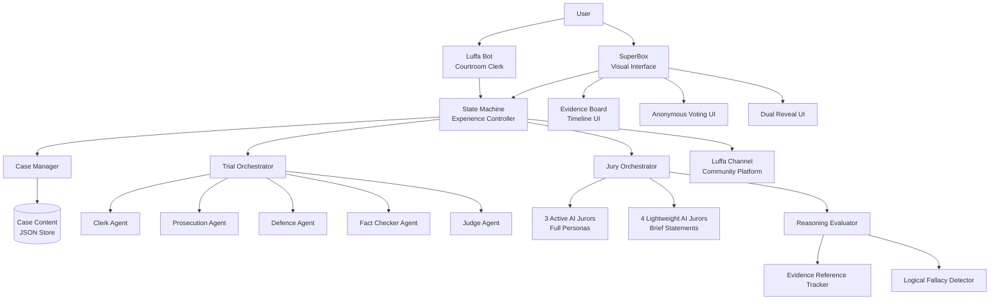

# VERITAS Courtroom Experience - Design Document

## Overview

VERITAS is an interactive 15-minute British Crown Court trial experience that combines narrative immersion with AI-driven courtroom simulation. The system orchestrates a complete trial workflow from atmospheric opening through structured proceedings to jury deliberation, culminating in a dual assessment of both verdict accuracy and reasoning quality.

The architecture integrates three Luffa platform components:
- **Luffa Bot**: Serves as courtroom clerk, providing procedural guidance and managing user interaction
- **SuperBox**: Delivers rich visual presentation of courtroom environments, evidence boards, and trial participants
- **Luffa Channel**: Handles case distribution and community verdict sharing

The system's core innovation lies in its dual-layer evaluation model. Unlike traditional interactive fiction that judges only outcomes, VERITAS assesses the quality of user reasoning independently from verdict correctness. This creates four possible outcomes: sound reasoning with correct verdict, sound reasoning with incorrect verdict, weak reasoning with correct verdict, and weak reasoning with incorrect verdict. This approach rewards logical thinking even when users reach the "wrong" conclusion.

### Key Technical Challenges

1. **State Machine Complexity**: Managing seamless transitions through 8+ trial stages while preserving user progress and enforcing timing constraints
2. **Multi-Agent Orchestration**: Coordinating 5 trial agents (Clerk, Prosecution, Defence, Fact Checker, Judge) with distinct roles and 8 jurors (3 active AI, 4 lightweight AI, 1 human) with varied personas
3. **Real-Time Reasoning Evaluation**: Analyzing user arguments during deliberation to assess logical coherence, evidence citation, and fallacy detection
4. **Evidence Timeline Visualization**: Presenting 5-7 evidence items in an interactive, chronologically organized interface
5. **Anonymous Voting Mechanism**: Collecting simultaneous votes from 8 jurors while maintaining anonymity until reveal
6. **Dual Reveal Orchestration**: Sequencing verdict announcement, truth disclosure, reasoning feedback, and AI juror identity revelation

### Target Experience Flow

```
Hook Scene (90s) 
  → Charge Reading (30s)
  → Prosecution Opening (60s)
  → Defence Opening (60s)
  → Evidence Presentation (120s)
  → Cross-Examination (90s)
  → Prosecution Closing (60s)
  → Defence Closing (60s)
  → Judge Summing Up (105s)
  → Jury Deliberation (300s)
  → Anonymous Vote (30s)
  → Dual Reveal (90s)
Total: ~15 minutes
```

## Architecture

### System Architecture Diagram



### Component Responsibilities

**State Machine (Experience Controller)**
- Manages experience flow through all trial stages
- Enforces stage sequencing and timing constraints
- Preserves user progress for 24 hours on disconnection
- Coordinates transitions between Luffa Bot, SuperBox, and backend services
- Implements 20-minute maximum duration enforcement

**Case Manager**
- Loads and validates case content from JSON store
- Provides case context to all AI agents
- Manages evidence item metadata and timeline data
- Validates case structure (5-7 evidence items, required fields)
- Handles case content serialization/deserialization

**Trial Orchestrator**
- Coordinates 5 trial layer AI agents
- Enforces Crown Court procedural order
- Manages fact-checking interventions (max 3 per trial)
- Generates agent prompts with case context
- Implements fallback responses for agent failures

**Jury Orchestrator**
- Manages 8-juror composition (3 active AI, 4 lightweight AI, 1 human)
- Assigns personas to active AI jurors
- Coordinates deliberation turn-taking
- Collects anonymous votes
- Triggers reasoning evaluation

**Reasoning Evaluator**
- Analyzes user statements during deliberation
- Tracks evidence item references
- Detects logical fallacies
- Produces four-category assessment
- Completes evaluation within 10 seconds of vote

**Evidence Board**
- Renders chronological timeline of evidence items
- Highlights items as they're presented during trial
- Provides detailed view on item selection
- Remains accessible throughout deliberation
- Integrates with SuperBox visual rendering

### Technology Stack Considerations

The design assumes:
- **Backend**: Node.js/TypeScript or Python for state machine and orchestration
- **AI Agents**: LLM API integration (OpenAI, Anthropic, or similar) with structured prompts
- **Storage**: JSON file storage for case content, with potential migration to database
- **Real-time Communication**: WebSocket or Server-Sent Events for live trial updates
- **Frontend**: SuperBox platform-specific rendering (details abstracted)
- **Luffa Platform**: Existing APIs for Bot, SuperBox, and Channel integration

## Components and Interfaces

### State Machine Component

The State Machine is the central controller managing experience flow.

**States:**
```typescript
enum ExperienceState {
  NOT_STARTED = 'not_started',
  HOOK_SCENE = 'hook_scene',
  CHARGE_READING = 'charge_reading',
  PROSECUTION_OPENING = 'prosecution_opening',
  DEFENCE_OPENING = 'defence_opening',
  EVIDENCE_PRESENTATION = 'evidence_presentation',
  CROSS_EXAMINATION = 'cross_examination',
  PROSECUTION_CLOSING = 'prosecution_closing',
  DEFENCE_CLOSING = 'defence_closing',
  JUDGE_SUMMING_UP = 'judge_summing_up',
  JURY_DELIBERATION = 'jury_deliberation',
  ANONYMOUS_VOTE = 'anonymous_vote',
  DUAL_REVEAL = 'dual_reveal',
  COMPLETED = 'completed'
}
```

**State Transitions:**
```typescript
interface StateTransition {
  fromState: ExperienceState;
  toState: ExperienceState;
  condition?: () => boolean;
  onEnter?: () => Promise<void>;
  onExit?: () => Promise<void>;
}
```

**Key Methods:**
- `transitionTo(state: ExperienceState): Promise<void>` - Validates and executes state transition
- `getCurrentState(): ExperienceState` - Returns current state
- `canTransitionTo(state: ExperienceState): boolean` - Checks if transition is valid
- `saveProgress(): Promise<void>` - Persists current state for recovery
- `restoreProgress(userId: string): Promise<ExperienceState>` - Loads saved state

**Timing Enforcement:**
- Each state has minimum and maximum duration
- State machine tracks elapsed time per state
- Automatic transition when maximum duration reached
- User can pause between stages for up to 2 minutes

### Case Manager Component

Handles case content loading, validation, and distribution.

**Interface:**
```typescript
interface CaseContent {
  caseId: string;
  title: string;
  narrative: {
    hookScene: string;
    chargeText: string;
    victimProfile: CharacterProfile;
    defendantProfile: CharacterProfile;
    witnessProfiles: CharacterProfile[];
  };
  evidence: EvidenceItem[];
  timeline: TimelineEvent[];
  groundTruth: {
    actualVerdict: 'guilty' | 'not_guilty';
    keyFacts: string[];
    reasoningCriteria: ReasoningCriteria;
  };
}

interface EvidenceItem {
  id: string;
  type: 'physical' | 'testimonial' | 'documentary';
  title: string;
  description: string;
  timestamp: string; // ISO 8601
  presentedBy: 'prosecution' | 'defence';
  significance: string;
}

interface CharacterProfile {
  name: string;
  role: string;
  background: string;
  relevantFacts: string[];
}
```

**Key Methods:**
- `loadCase(caseId: string): Promise<CaseContent>` - Loads and validates case
- `validateCase(content: CaseContent): ValidationResult` - Checks required fields
- `getEvidenceItems(): EvidenceItem[]` - Returns all evidence
- `getEvidenceByTimestamp(): EvidenceItem[]` - Returns chronologically sorted evidence
- `serializeCase(content: CaseContent): string` - Converts to JSON
- `deserializeCase(json: string): CaseContent` - Parses from JSON

### Trial Orchestrator Component

Coordinates the 5 trial layer AI agents through Crown Court procedure.

**Agent Configuration:**
```typescript
interface TrialAgent {
  role: 'clerk' | 'prosecution' | 'defence' | 'fact_checker' | 'judge';
  systemPrompt: string;
  characterLimit: number;
  responseTimeout: number; // milliseconds
}

interface AgentResponse {
  agentRole: string;
  content: string;
  timestamp: Date;
  metadata?: Record<string, any>;
}
```

**Key Methods:**
- `initializeAgents(caseContent: CaseContent): Promise<void>` - Sets up agents with case context
- `executeStage(stage: ExperienceState): Promise<AgentResponse[]>` - Runs agents for current stage
- `checkFactAccuracy(statement: string): Promise<FactCheckResult>` - Validates statements against case
- `generateJudgeSummary(): Promise<string>` - Creates judge's summing up
- `handleAgentFailure(agent: TrialAgent): Promise<AgentResponse>` - Returns fallback response

**Fact Checking Logic:**
- Monitors prosecution and defence statements during evidence and cross-examination stages
- Compares statements against case content ground truth
- Triggers fact checker agent when contradiction detected
- Limits interventions to 3 per trial
- Excludes opening and closing speeches from fact checking

### Jury Orchestrator Component

Manages the 8-juror deliberation system with 3 active AI, 4 lightweight AI, and 1 human.

**Juror Configuration:**
```typescript
interface JurorPersona {
  id: string;
  type: 'active_ai' | 'lightweight_ai' | 'human';
  persona?: 'evidence_purist' | 'sympathetic_doubter' | 'moral_absolutist';
  systemPrompt?: string;
}

interface DeliberationTurn {
  jurorId: string;
  statement: string;
  timestamp: Date;
  evidenceReferences: string[]; // Evidence item IDs
}
```

**Key Methods:**
- `initializeJury(caseContent: CaseContent): Promise<void>` - Creates 8 jurors (7 AI with personas + 1 human)
- `startDeliberation(): Promise<void>` - Begins deliberation phase
- `processUserStatement(statement: string): Promise<DeliberationTurn[]>` - User speaks, AI jurors respond
- `collectVotes(): Promise<VoteResult>` - Gathers anonymous votes from all 8 jurors
- `revealJurors(): JurorReveal[]` - Discloses AI identities and votes

**Deliberation Flow:**
- User prompted for initial thoughts
- 3 active AI jurors engage in back-and-forth debate
- 4 lightweight AI jurors contribute brief statements
- User can reference evidence items
- 15-second response time for AI jurors
- 4-6 minute duration, hard cutoff at 6 minutes

### Reasoning Evaluator Component

Analyzes user's deliberation statements to assess reasoning quality.

**Evaluation Criteria:**
```typescript
interface ReasoningCriteria {
  requiredEvidenceReferences: string[]; // Evidence IDs that should be mentioned
  logicalFallacies: string[]; // Fallacies to detect
  coherenceThreshold: number; // 0-1 score
}

interface ReasoningAssessment {
  category: 'sound_correct' | 'sound_incorrect' | 'weak_correct' | 'weak_incorrect';
  evidenceScore: number; // 0-1, based on relevant evidence cited
  coherenceScore: number; // 0-1, based on logical flow
  fallaciesDetected: string[];
  feedback: string;
}
```

**Key Methods:**
- `analyzeStatements(statements: string[]): Promise<ReasoningAssessment>` - Evaluates all user statements
- `trackEvidenceReferences(statement: string): string[]` - Extracts evidence item mentions
- `detectFallacies(statement: string): string[]` - Identifies logical fallacies
- `calculateCoherence(statements: string[]): number` - Assesses logical consistency
- `generateFeedback(assessment: ReasoningAssessment): string` - Creates user-facing feedback

**Evaluation Process:**
1. Collect all user statements from deliberation
2. Extract evidence item references
3. Detect logical fallacies (ad hominem, appeal to emotion, false dichotomy, etc.)
4. Calculate coherence score based on argument structure
5. Compare user verdict with ground truth
6. Categorize into one of four outcomes
7. Generate specific feedback with examples

### Evidence Board Component

Visual interface for displaying and interacting with case evidence.

**Interface:**
```typescript
interface EvidenceBoard {
  items: EvidenceItem[];
  timeline: TimelineEvent[];
  highlightedItemId?: string;
}

interface TimelineEvent {
  timestamp: string; // ISO 8601
  description: string;
  evidenceIds: string[];
}
```

**Key Methods:**
- `renderTimeline(): void` - Displays chronological evidence timeline
- `highlightItem(itemId: string): void` - Emphasizes item during trial presentation
- `selectItem(itemId: string): void` - Shows detailed evidence view
- `filterByType(type: EvidenceType): EvidenceItem[]` - Filters evidence display
- `searchEvidence(query: string): EvidenceItem[]` - Finds evidence by keyword

**Visual Requirements:**
- Chronological timeline with date markers
- Evidence items positioned at appropriate timestamps
- Highlight animation when item presented during trial
- Detailed modal/panel on item selection
- Persistent access during deliberation
- Responsive layout for SuperBox rendering

### Luffa Platform Integration

**Luffa Bot Interface:**
```typescript
interface LuffaBotMessage {
  type: 'greeting' | 'stage_announcement' | 'prompt' | 'response';
  content: string;
  metadata?: {
    stage?: ExperienceState;
    requiresSuperBox?: boolean;
  };
}
```

**SuperBox Interface:**
```typescript
interface SuperBoxScene {
  sceneType: 'courtroom' | 'jury_chamber' | 'evidence_board' | 'reveal';
  elements: SceneElement[];
  activeAgent?: string;
}

interface SceneElement {
  type: 'background' | 'character' | 'evidence' | 'ui_component';
  id: string;
  properties: Record<string, any>;
}
```

**Luffa Channel Interface:**
```typescript
interface ChannelAnnouncement {
  type: 'new_case' | 'verdict_share' | 'statistics';
  caseId: string;
  content: string;
  metadata?: Record<string, any>;
}

interface VerdictShare {
  caseId: string;
  verdict: 'guilty' | 'not_guilty';
  anonymous: boolean;
  timestamp: Date;
}
```

## Data Models

### Core Data Structures

**Session State:**
```typescript
interface UserSession {
  sessionId: string;
  userId: string;
  caseId: string;
  currentState: ExperienceState;
  startTime: Date;
  lastActivityTime: Date;
  progress: {
    completedStages: ExperienceState[];
    deliberationStatements: DeliberationTurn[];
    vote?: 'guilty' | 'not_guilty';
    reasoningAssessment?: ReasoningAssessment;
  };
  metadata: {
    pauseCount: number;
    totalPauseDuration: number; // milliseconds
    agentFailures: number;
  };
}
```

**Vote Collection:**
```typescript
interface VoteCollection {
  sessionId: string;
  votes: JurorVote[];
  collectionStartTime: Date;
  collectionEndTime?: Date;
  result?: VoteResult;
}

interface JurorVote {
  jurorId: string;
  vote: 'guilty' | 'not_guilty';
  timestamp: Date;
}

interface VoteResult {
  verdict: 'guilty' | 'not_guilty';
  guiltyCount: number;
  notGuiltyCount: number;
  jurorBreakdown: {
    jurorId: string;
    type: 'active_ai' | 'lightweight_ai' | 'human';
    vote: 'guilty' | 'not_guilty';
  }[];
}
```

**Dual Reveal Data:**
```typescript
interface DualReveal {
  verdict: VoteResult;
  groundTruth: {
    actualVerdict: 'guilty' | 'not_guilty';
    explanation: string;
    keyEvidence: string[];
  };
  reasoningAssessment: ReasoningAssessment;
  jurorReveal: {
    jurorId: string;
    type: 'active_ai' | 'lightweight_ai' | 'human';
    persona?: string;
    vote: 'guilty' | 'not_guilty';
    keyStatements?: string[];
  }[];
}
```

### Storage Schema

**Case Content Storage (JSON):**
```json
{
  "caseId": "blackthorn-hall-001",
  "title": "The Crown v. Marcus Ashford",
  "narrative": {
    "hookScene": "...",
    "chargeText": "...",
    "victimProfile": {...},
    "defendantProfile": {...},
    "witnessProfiles": [...]
  },
  "evidence": [
    {
      "id": "evidence-001",
      "type": "physical",
      "title": "Forged Will Document",
      "description": "...",
      "timestamp": "2024-01-15T14:30:00Z",
      "presentedBy": "prosecution",
      "significance": "..."
    }
  ],
  "timeline": [...],
  "groundTruth": {
    "actualVerdict": "not_guilty",
    "keyFacts": [...],
    "reasoningCriteria": {...}
  }
}
```

**Session Storage:**
- Sessions stored in memory during active experience
- Persisted to disk/database on state transitions
- 24-hour retention for disconnected sessions
- Cleanup of completed sessions after 7 days

### Data Flow

**Trial Flow:**
```
User starts → Load case content → Initialize state machine
→ Present hook scene → Transition through trial stages
→ Each stage: Generate agent responses → Update SuperBox → Notify Luffa Bot
→ Track timing and enforce constraints
```

**Deliberation Flow:**
```
Judge summing up completes → Initialize jury orchestrator
→ Prompt user for initial thoughts → User statement received
→ Track evidence references → Generate AI juror responses
→ Continue turn-taking for 4-6 minutes → Force transition at 6 minutes
→ Collect anonymous votes → Trigger reasoning evaluation
```

**Reveal Flow:**
```
Votes collected → Calculate verdict → Retrieve ground truth
→ Complete reasoning evaluation → Assemble dual reveal data
→ Display verdict with vote count → Display ground truth
→ Display reasoning assessment → Reveal AI juror identities
→ Offer Luffa Channel sharing
```


## Correctness Properties

*A property is a characteristic or behavior that should hold true across all valid executions of a system—essentially, a formal statement about what the system should do. Properties serve as the bridge between human-readable specifications and machine-verifiable correctness guarantees.*

### Property 1: Case Content Serialization Round-Trip

*For any* valid case content object, serializing to JSON then deserializing back SHALL produce an equivalent object with all fields preserved.

**Validates: Requirements 1.6**

### Property 2: Case Content Validation

*For any* case content object, validation SHALL pass if and only if all required fields are present: narrative (with hookScene, chargeText, victimProfile, defendantProfile, witnessProfiles), evidence array, timeline, groundTruth (with actualVerdict, keyFacts, reasoningCriteria), and character profiles for defendant, victim, and witnesses.

**Validates: Requirements 1.2, 1.4, 1.5**

### Property 3: Trial Stage Sequential Progression

*For any* trial stage, when that stage completes, the state machine SHALL automatically transition to the next stage in the Crown Court procedure order: Charge reading → Prosecution opening → Defence opening → Evidence presentation → Cross-examination → Prosecution closing → Defence closing → Judge summing up → Jury deliberation → Anonymous vote → Dual reveal.

**Validates: Requirements 2.2, 3.4, 5.3, 5.4, 5.5, 7.1, 10.1, 12.1, 18.1**

### Property 4: Stage Skipping Prevention

*For any* trial stage sequence, attempting to transition to a non-adjacent future stage SHALL be rejected, ensuring users cannot skip required stages.

**Validates: Requirements 2.3, 18.4**

### Property 5: Session State Persistence Round-Trip

*For any* user session state, saving the state then restoring it SHALL produce an equivalent session with the same current stage, progress, and user data preserved.

**Validates: Requirements 2.4**

### Property 6: Maximum Duration Enforcement

*For any* user session, the state machine SHALL track elapsed time and enforce a maximum total duration of 20 minutes, automatically transitioning to completion if exceeded.

**Validates: Requirements 2.5**

### Property 7: Hook Scene Content Completeness

*For any* hook scene presentation, the content SHALL include references to the victim, defendant, and central mystery of the case.

**Validates: Requirements 3.3**

### Property 8: Evidence Board Completeness

*For any* case content with N evidence items, the evidence board SHALL display all N items with their descriptions and timestamps, organized chronologically by timestamp.

**Validates: Requirements 4.1, 4.4**

### Property 9: Evidence Highlighting

*For any* evidence item, when that item is presented during trial, the evidence board SHALL update its highlighted item ID to match that evidence item.

**Validates: Requirements 4.2**

### Property 10: Fact Checker Contradiction Detection

*For any* statement made by prosecution or defence during evidence presentation or cross-examination that contradicts case content facts, the fact checker SHALL trigger an intervention citing the specific contradicting evidence item.

**Validates: Requirements 6.1, 6.2**

### Property 11: Fact Checker Intervention Limit

*For any* trial session, the fact checker SHALL intervene a maximum of 3 times, regardless of how many contradictions occur.

**Validates: Requirements 6.3**

### Property 12: Fact Checker Stage Restriction

*For any* statement made during opening speeches or closing speeches, the fact checker SHALL NOT intervene, even if the statement contradicts case content.

**Validates: Requirements 6.4**

### Property 13: Judge Summary Content Requirements

*For any* judge summing up, the content SHALL include: (1) references to key evidence from both prosecution and defence, (2) legal instructions mentioning "burden of proof" and "reasonable doubt", and (3) no explicit opinion on verdict outcome.

**Validates: Requirements 7.2, 7.3, 7.5**

### Property 14: Jury Deliberation User Evidence References

*For any* user statement during jury deliberation that references an evidence item by ID or title, the system SHALL accept and track that reference for reasoning evaluation.

**Validates: Requirements 9.4**

### Property 15: Deliberation Hard Time Limit

*For any* jury deliberation session, when 6 minutes have elapsed, the system SHALL automatically transition to anonymous voting regardless of the current discussion state.

**Validates: Requirements 9.5**

### Property 16: Anonymous Voting Identity Concealment

*For any* voting interface presentation, the interface SHALL display only vote options ("Guilty" and "Not Guilty") without revealing juror identities, and individual votes SHALL NOT be accessible until dual reveal.

**Validates: Requirements 10.2, 10.4, 8.5**

### Property 17: Vote Collection Completeness

*For any* voting session, the system SHALL collect exactly 8 votes (3 active AI + 4 lightweight AI + 1 human) before proceeding to verdict calculation.

**Validates: Requirements 10.3**

### Property 18: Majority Verdict Calculation

*For any* set of 8 votes, the verdict outcome SHALL be "guilty" if 5 or more votes are guilty, and "not guilty" if 5 or more votes are not guilty.

**Validates: Requirements 10.5**

### Property 19: Reasoning Evaluation Four-Category Output

*For any* reasoning evaluation, the output SHALL be exactly one of four categories: "sound_correct", "sound_incorrect", "weak_correct", or "weak_incorrect", determined by combining reasoning quality (sound/weak) with verdict correctness (correct/incorrect).

**Validates: Requirements 11.4**

### Property 20: Reasoning Evaluation Evidence Tracking

*For any* user statement during deliberation that mentions an evidence item, the reasoning evaluator SHALL detect and record that evidence reference for scoring.

**Validates: Requirements 11.2**

### Property 21: Reasoning Evaluation Fallacy Detection

*For any* user statement containing a known logical fallacy (ad hominem, appeal to emotion, false dichotomy, straw man, etc.), the reasoning evaluator SHALL identify and record that fallacy.

**Validates: Requirements 11.3**

### Property 22: Dual Reveal Completeness

*For any* dual reveal presentation, the data SHALL include in sequence: (1) verdict outcome with vote count, (2) ground truth with actual verdict and explanation, (3) user's reasoning evaluation with feedback, and (4) juror identities revealing which were AI with their votes.

**Validates: Requirements 12.2, 12.3, 12.4, 12.5**

### Property 23: Stage Announcement on Transition

*For any* trial stage transition, the Luffa Bot SHALL generate an announcement message containing the new stage name and purpose.

**Validates: Requirements 13.2**

### Property 24: SuperBox Launch Prompts

*For any* trial stage that requires visual content (hook scene, evidence presentation, jury deliberation, dual reveal), the Luffa Bot SHALL prompt the user to launch SuperBox when entering that stage.

**Validates: Requirements 13.3**

### Property 25: New Case Announcement

*For any* new case content added to the system, the Luffa Channel SHALL generate an announcement indicating the case is available.

**Validates: Requirements 15.1**

### Property 26: Completion Share Offer

*For any* user session that reaches the completed state, the system SHALL present an offer to share the verdict outcome to Luffa Channel.

**Validates: Requirements 15.2**

### Property 27: Reasoning Score Privacy

*For any* verdict share to Luffa Channel, the shared data SHALL include verdict outcome but SHALL NOT include the user's reasoning evaluation score or category.

**Validates: Requirements 15.4**

### Property 28: Opt-In Anonymous Sharing

*For any* user who opts in to sharing, the system SHALL post their verdict to Luffa Channel with anonymous attribution (no user ID or name).

**Validates: Requirements 15.5**

### Property 29: Evidence Board Accessibility During Deliberation

*For any* jury deliberation session, the evidence board SHALL remain accessible and return all evidence items when queried.

**Validates: Requirements 4.3**

### Property 30: Pause Duration Limit

*For any* pause between trial stages, the system SHALL allow pausing for up to 2 minutes, then automatically resume or prompt the user to continue.

**Validates: Requirements 18.3**

### Property 31: Progress Indicator Accuracy

*For any* point in the experience, the system SHALL expose the current trial stage in progress indicators, matching the actual state machine state.

**Validates: Requirements 18.5**

### Property 32: Agent Prompt Storage

*For any* trial layer agent (Clerk, Prosecution, Defence, Fact Checker, Judge) and any juror persona (Evidence Purist, Sympathetic Doubter, Moral Absolutist), the system SHALL have a stored system prompt defining their role and constraints.

**Validates: Requirements 19.1, 19.2**

### Property 33: Agent Character Limit Enforcement

*For any* AI agent response, the content length SHALL not exceed the character limit configured for that agent's current trial stage.

**Validates: Requirements 19.3**

### Property 34: Agent Case Context Provision

*For any* AI agent initialization, the agent SHALL receive the complete case content as context before generating any responses.

**Validates: Requirements 19.4**

### Property 35: Agent Information Sequencing

*For any* AI agent response during a trial stage, the content SHALL NOT reference evidence items or facts that have not yet been presented in earlier stages.

**Validates: Requirements 19.5**

### Property 36: Agent Timeout Fallback

*For any* AI agent that fails to respond within 30 seconds, the system SHALL use a predefined fallback response appropriate to that agent's role and current stage.

**Validates: Requirements 20.1**

### Property 37: SuperBox Failure Graceful Degradation

*For any* SuperBox loading failure, the Luffa Bot SHALL provide text-based descriptions of visual content as an alternative.

**Validates: Requirements 20.2**

### Property 38: Reasoning Evaluation Failure Isolation

*For any* reasoning evaluation failure, the system SHALL still proceed to display verdict outcome and truth reveal, omitting only the reasoning assessment portion.

**Validates: Requirements 20.3**

### Property 39: Error Logging Without Interruption

*For any* error that occurs during the experience, the system SHALL log the error details without throwing an exception that interrupts the user's flow.

**Validates: Requirements 20.4**

### Property 40: Critical Failure Recovery Offer

*For any* critical failure that prevents continuation, the system SHALL present the user with an option to restart from the last successfully completed trial stage.

**Validates: Requirements 20.5**

## Error Handling

### Error Categories

**Agent Failures:**
- AI agent timeout (>30 seconds): Use fallback response, log error, continue experience
- AI agent invalid response: Retry once, then use fallback, log error
- AI agent rate limit: Queue request, use fallback if queue exceeds 10 seconds, log error

**Platform Integration Failures:**
- SuperBox load failure: Switch to text-only mode via Luffa Bot, log error
- Luffa Channel unavailable: Disable sharing features, log error, continue experience
- Luffa Bot disconnection: Buffer messages, retry connection, display cached content

**State Management Failures:**
- State persistence failure: Continue in-memory, warn user progress may not save, log error
- State corruption: Attempt recovery from last valid state, offer restart if unrecoverable
- Invalid state transition: Reject transition, log error, maintain current state

**Reasoning Evaluation Failures:**
- Evaluation timeout: Skip reasoning assessment, proceed with verdict and truth reveal
- Evaluation service unavailable: Skip reasoning assessment, log error
- Invalid evaluation result: Use default "evaluation unavailable" message, log error

**Data Validation Failures:**
- Invalid case content: Reject case load, log detailed validation errors, prevent experience start
- Missing evidence items: Log warning, continue with available evidence
- Malformed user input: Sanitize input, log warning, prompt user to rephrase

### Error Recovery Strategies

**Graceful Degradation:**
- Visual content → Text descriptions
- Full reasoning evaluation → Verdict only
- Real-time AI responses → Cached fallback responses
- Multi-agent debate → Single-agent summaries

**State Preservation:**
- Auto-save state every 30 seconds during active stages
- Persist state on every stage transition
- Maintain 24-hour recovery window for disconnected sessions
- Checkpoint before critical operations (voting, evaluation)

**User Communication:**
- Silent recovery for minor errors (agent retries, brief delays)
- Subtle notifications for degraded functionality (text-only mode)
- Clear messages for user-impacting failures (restart offers)
- Never expose technical error details to users

**Fallback Content:**
- Pre-written agent responses for each stage and role
- Generic judge summaries referencing case structure
- Default juror statements for each persona
- Standard procedural announcements

### Logging and Monitoring

**Error Logs:**
- Timestamp, session ID, user ID (anonymized)
- Error type, component, severity level
- Context: current state, recent actions, case ID
- Stack trace for debugging (backend only)

**Metrics to Track:**
- Agent failure rate by role and stage
- Average response times per agent
- State transition success rate
- Reasoning evaluation completion rate
- User session completion rate
- Error recovery success rate

**Alerting Thresholds:**
- Agent failure rate >10% in 5-minute window
- State persistence failure rate >5%
- Critical failures >3 in 1-minute window
- Session completion rate <80% over 1 hour

## Testing Strategy

### Dual Testing Approach

VERITAS requires both unit testing and property-based testing to ensure correctness. Unit tests verify specific examples, edge cases, and integration points, while property-based tests verify universal properties across all inputs. Together, they provide comprehensive coverage: unit tests catch concrete bugs in specific scenarios, while property tests verify general correctness across the input space.

### Property-Based Testing

**Framework Selection:**
- **TypeScript/JavaScript**: fast-check library
- **Python**: Hypothesis library

**Configuration:**
- Minimum 100 iterations per property test (due to randomization)
- Each test must reference its design document property
- Tag format: `Feature: veritas-courtroom-experience, Property {number}: {property_text}`

**Property Test Implementation:**

Each of the 40 correctness properties defined above MUST be implemented as a single property-based test. Examples:

**Property 1 (Serialization Round-Trip):**
```typescript
// Feature: veritas-courtroom-experience, Property 1: Case Content Serialization Round-Trip
fc.assert(
  fc.property(caseContentArbitrary, (caseContent) => {
    const serialized = JSON.stringify(caseContent);
    const deserialized = JSON.parse(serialized);
    expect(deserialized).toEqual(caseContent);
  }),
  { numRuns: 100 }
);
```

**Property 3 (Stage Sequential Progression):**
```typescript
// Feature: veritas-courtroom-experience, Property 3: Trial Stage Sequential Progression
fc.assert(
  fc.property(trialStageArbitrary, (currentStage) => {
    const stateMachine = new StateMachine();
    stateMachine.setState(currentStage);
    stateMachine.completeStage();
    const nextStage = stateMachine.getCurrentState();
    expect(nextStage).toBe(getExpectedNextStage(currentStage));
  }),
  { numRuns: 100 }
);
```

**Property 18 (Majority Verdict Calculation):**
```typescript
// Feature: veritas-courtroom-experience, Property 18: Majority Verdict Calculation
fc.assert(
  fc.property(
    fc.array(fc.constantFrom('guilty', 'not_guilty'), { minLength: 8, maxLength: 8 }),
    (votes) => {
      const verdict = calculateVerdict(votes);
      const guiltyCount = votes.filter(v => v === 'guilty').length;
      if (guiltyCount >= 5) {
        expect(verdict).toBe('guilty');
      } else {
        expect(verdict).toBe('not_guilty');
      }
    }
  ),
  { numRuns: 100 }
);
```

**Generators (Arbitraries):**

Property tests require generators for random test data:

- `caseContentArbitrary`: Generates valid case content with random evidence items, characters, timelines
- `trialStageArbitrary`: Generates random trial stages
- `evidenceItemArbitrary`: Generates random evidence items with types, timestamps, descriptions
- `jurorVoteArbitrary`: Generates random vote arrays
- `userStatementArbitrary`: Generates random user deliberation statements
- `sessionStateArbitrary`: Generates random session states with progress data

### Unit Testing

**Focus Areas:**

Unit tests should focus on specific examples, edge cases, and integration points that property tests don't cover well:

**Specific Examples:**
- Blackthorn Hall case loads correctly (Requirement 16.1)
- Jury composition is exactly 3 active AI + 4 lightweight AI + 1 human (Requirement 8.1)
- Trial layer has exactly 5 agents with correct roles (Requirement 5.1)
- Evidence board accessible during deliberation state (Requirement 4.3)
- Luffa Bot greeting on experience start (Requirement 13.1)
- User prompted for initial thoughts when deliberation begins (Requirement 9.1)
- Jury personas are Evidence Purist, Sympathetic Doubter, Moral Absolutist (Requirement 8.2)

**Edge Cases:**
- Empty evidence list handling
- Single juror voting (should never happen, but test boundary)
- Zero-length deliberation statements
- Malformed case content JSON
- State machine at final state (no next transition)
- Fact checker at intervention limit (3rd intervention)

**Integration Points:**
- State machine triggers Luffa Bot announcements on transitions
- Evidence board updates when trial orchestrator presents evidence
- Jury orchestrator triggers reasoning evaluator after vote collection
- Case manager provides context to all agents during initialization
- Dual reveal assembles data from vote result, ground truth, and reasoning assessment

**Error Conditions:**
- Agent timeout triggers fallback response
- SuperBox failure triggers text-only mode
- Reasoning evaluation failure still shows verdict
- Invalid state transition is rejected
- Critical failure offers restart

**Timing Constraints:**
- Hook scene duration between 60-90 seconds (Requirement 3.2)
- Judge summing up duration between 90-120 seconds (Requirement 7.4)
- Deliberation duration between 4-6 minutes (Requirement 9.2)
- Total experience targets 15 minutes (Requirement 17.1)

### Test Organization

```
tests/
├── unit/
│   ├── state-machine.test.ts
│   ├── case-manager.test.ts
│   ├── trial-orchestrator.test.ts
│   ├── jury-orchestrator.test.ts
│   ├── reasoning-evaluator.test.ts
│   ├── evidence-board.test.ts
│   └── integration/
│       ├── state-transitions.test.ts
│       ├── agent-coordination.test.ts
│       └── dual-reveal.test.ts
├── property/
│   ├── case-content.property.test.ts
│   ├── state-machine.property.test.ts
│   ├── trial-flow.property.test.ts
│   ├── jury-system.property.test.ts
│   ├── reasoning-evaluation.property.test.ts
│   └── error-handling.property.test.ts
└── fixtures/
    ├── blackthorn-hall.json
    ├── fallback-responses.json
    └── test-cases.json
```

### Testing Priorities

**Critical Path (Must Test First):**
1. State machine transitions and sequencing (Properties 3, 4, 6)
2. Case content loading and validation (Properties 1, 2)
3. Vote collection and verdict calculation (Properties 17, 18)
4. Dual reveal data assembly (Property 22)

**High Priority:**
5. Fact checker logic (Properties 10, 11, 12)
6. Reasoning evaluation (Properties 19, 20, 21)
7. Evidence board functionality (Properties 8, 9, 29)
8. Error handling and fallbacks (Properties 36-40)

**Medium Priority:**
9. Agent orchestration (Properties 13, 23, 24, 32-35)
10. Timing constraints (Properties 15, 30)
11. Platform integration (Properties 25-28)

**Lower Priority:**
12. Content validation (Properties 7, 31)
13. Privacy and anonymity (Properties 16, 27, 28)

### Manual Testing

Some requirements cannot be fully automated and require manual verification:

- SuperBox visual rendering quality (Requirements 14.1-14.5)
- Luffa Bot tone and style (Requirement 13.5)
- AI agent response quality and believability
- User experience flow and timing feel
- Evidence board usability and clarity
- Dual reveal presentation impact
- Overall 15-minute experience pacing

### Performance Testing

While not covered by correctness properties, performance testing should verify:

- Agent response times under load
- State persistence latency
- Reasoning evaluation completion time
- Concurrent user session handling
- Memory usage during long sessions

