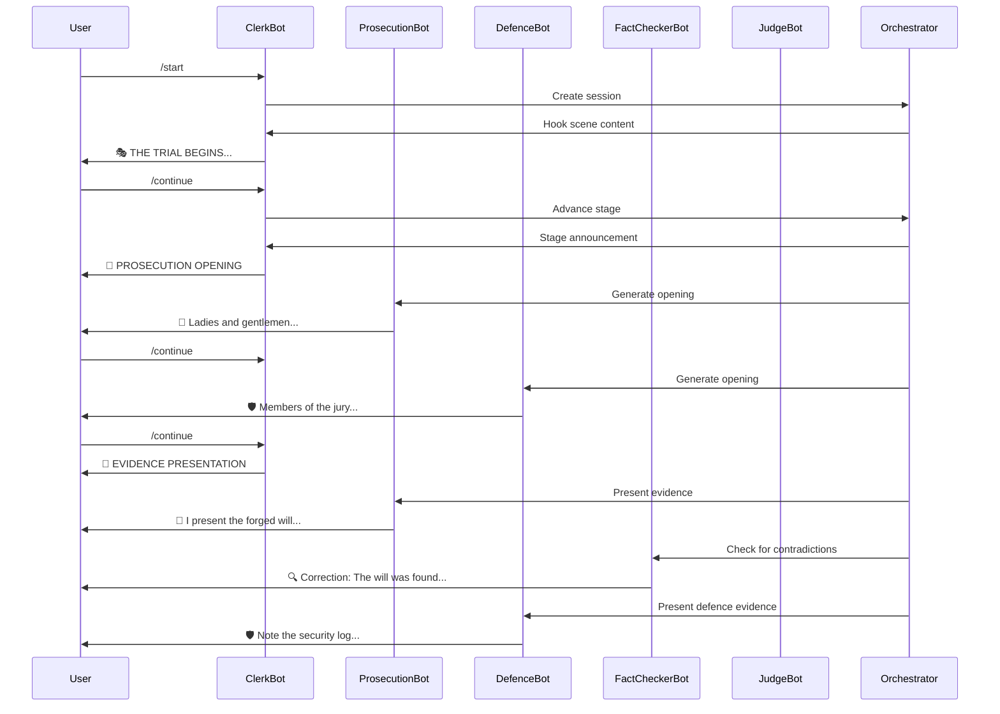
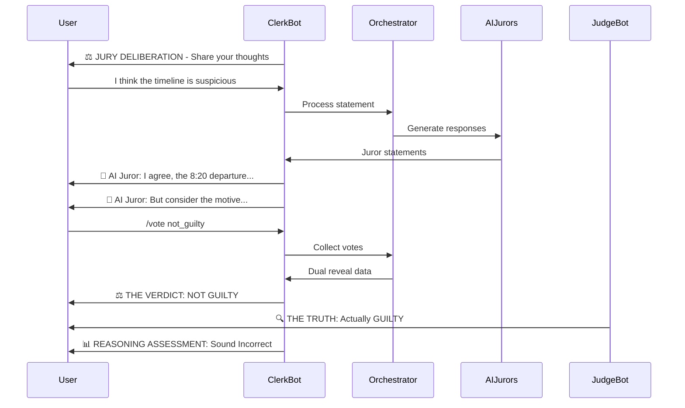

# VERITAS Multi-Bot Architecture

## Overview

VERITAS uses a **multi-bot architecture** where each courtroom participant is implemented as a separate Luffa bot. This creates an immersive group chat experience where users interact with multiple AI agents, each with distinct personalities and roles.

## Why Multi-Bot?

### Traditional Single-Bot Approach
```
[Bot]: 👔 PROSECUTION: I present the evidence...
[Bot]: 🛡️ DEFENCE: I object to this characterization...
[Bot]: ⚖️ JUDGE: Objection overruled...
```

All messages come from one bot with role labels. Less immersive.

### Multi-Bot Approach
```
[Prosecution Bot]: I present the evidence...
[Defence Bot]: I object to this characterization...
[Judge Bot]: Objection overruled...
```

Each agent is a distinct participant. More realistic and engaging.

## Architecture

### Bot Roles

| Bot | Role | Responsibilities |
|-----|------|------------------|
| **Clerk Bot** | Orchestrator | Manages flow, commands, announcements |
| **Prosecution Bot** | Crown Prosecutor | Argues for guilty verdict |
| **Defence Bot** | Defence Barrister | Creates reasonable doubt |
| **Fact Checker Bot** | Neutral Monitor | Intervenes on contradictions |
| **Judge Bot** | Presiding Judge | Legal instructions, summing up |

### Optional: Juror Bots (7 additional)

| Bot | Persona | Characteristics |
|-----|---------|-----------------|
| **Juror 1 Bot** | Evidence Purist | Focuses on hard facts |
| **Juror 2 Bot** | Sympathetic Doubter | Considers defendant's perspective |
| **Juror 3 Bot** | Moral Absolutist | Strong ethical stance |
| **Jurors 4-7 Bots** | Lightweight | Brief contributions |

## System Components

### 1. MultiBotClient (`src/multi_bot_client.py`)

Manages multiple Luffa bot connections.

**Key Features:**
- Initializes separate API client for each bot
- Routes messages to appropriate bot
- Handles fallback to single-bot mode
- Manages bot lifecycle

**Methods:**
- `get_client(agent_role)` - Get client for specific role
- `send_as_agent(agent_role, group_id, message)` - Send from specific bot
- `poll_messages(agent_role)` - Poll messages for specific bot
- `get_configured_roles()` - List all configured bots

### 2. MultiBotService (`src/multi_bot_service.py`)

Main service orchestrating the trial experience.

**Key Features:**
- Polls messages from Clerk bot (main orchestrator)
- Routes commands to handlers
- Sends agent responses from appropriate bots
- Manages user sessions per Luffa UID
- Supports multiple concurrent users in same group

**Flow:**
```
User sends /start
  → MultiBotService creates ExperienceOrchestrator
  → Clerk bot sends greeting
  → Clerk bot presents hook scene

User sends /continue
  → Orchestrator advances stage
  → Clerk bot announces stage
  → Prosecution/Defence/Judge bot speaks (depending on stage)
  → Fact Checker bot may intervene

User sends /vote guilty
  → Orchestrator collects votes
  → Clerk bot announces verdict
  → Judge bot reveals truth
  → Clerk bot shows reasoning assessment
```

### 3. Configuration (`src/config.py`)

Loads bot credentials from environment variables.

**Structure:**
```python
LuffaConfig:
  - clerk_bot: LuffaBotConfig(uid, secret, enabled)
  - prosecution_bot: LuffaBotConfig(uid, secret, enabled)
  - defence_bot: LuffaBotConfig(uid, secret, enabled)
  - fact_checker_bot: LuffaBotConfig(uid, secret, enabled)
  - judge_bot: LuffaBotConfig(uid, secret, enabled)
  - juror_bots: dict[str, LuffaBotConfig]
```

## Message Flow

### Stage Execution Flow



### Deliberation Flow



## Session Management

### Multi-User Support

The system supports multiple concurrent users in the same group chat:

```python
# User A starts trial
uid_to_session["user_a"] = "session_a"
active_sessions["session_a"] = OrchestratorA

# User B starts trial (same group)
uid_to_session["user_b"] = "session_b"
active_sessions["session_b"] = OrchestratorB

# Each user has independent trial progress
```

### Session Recovery

If a user disconnects and reconnects within 24 hours:
- Session restored from persistent storage
- User can continue from last completed stage
- Progress preserved (deliberation statements, votes, etc.)

## Deployment

### Development Mode

```bash
# Test configuration
python test_multi_bot_config.py

# Start service
python src/multi_bot_service.py
```

### Production Mode

```bash
# Use process manager (systemd, supervisor, pm2)
pm2 start src/multi_bot_service.py --name veritas-bots --interpreter python3

# Or Docker
docker build -t veritas-multi-bot .
docker run -d --env-file .env veritas-multi-bot
```

### Monitoring

```bash
# Check logs
tail -f logs/veritas.log

# Monitor active sessions
python -c "from multi_bot_service import MultiBotService; s = MultiBotService(); print(len(s.active_sessions))"
```

## Scaling Considerations

### Current Limits

- **Concurrent Users**: Limited by memory (each session ~10MB)
- **Message Rate**: Luffa API rate limits apply per bot
- **LLM API**: OpenAI rate limits apply (tier-based)

### Optimization Strategies

1. **Connection Pooling**: Reuse HTTP connections per bot
2. **Response Caching**: Cache common fallback responses
3. **Async Processing**: All I/O is async (aiohttp, asyncio)
4. **Session Cleanup**: Auto-cleanup completed sessions after 24 hours

### Horizontal Scaling

For high load:
- Run multiple service instances
- Use Redis for session storage (instead of in-memory)
- Load balance by group ID
- Separate bot polling from message handling

## Error Handling

### Bot Unavailable

If a bot is not configured:
- Falls back to Clerk bot with role label
- Logs warning
- Experience continues

### API Failure

If Luffa API fails:
- Retries with exponential backoff
- Falls back to text-only mode
- Logs error
- Experience continues

### LLM Failure

If LLM API fails:
- Uses predefined fallback responses
- Logs error
- Experience continues

## Testing

### Unit Tests

```bash
# Test configuration
pytest tests/unit/test_config.py

# Test multi-bot client
pytest tests/unit/test_multi_bot_client.py
```

### Integration Tests

```bash
# Test end-to-end with mock Luffa API
pytest tests/integration/test_multi_bot_flow.py
```

### Manual Testing

1. Create test group with all 5 bots
2. Send `/start` command
3. Verify each bot responds appropriately
4. Test full trial flow
5. Verify dual reveal sequence

## Future Enhancements

### Phase 1: Core Multi-Bot (Current)
- ✅ 5 trial agent bots
- ✅ Command handling
- ✅ Stage progression
- ✅ Dual reveal

### Phase 2: Juror Bots
- ⏳ 7 separate juror bots
- ⏳ Persona-based responses
- ⏳ Deliberation dynamics

### Phase 3: Advanced Features
- ⏳ SuperBox visual integration
- ⏳ Luffa Channel verdict sharing
- ⏳ Analytics dashboard
- ⏳ Multiple case support

## Comparison: Single-Bot vs Multi-Bot

| Feature | Single-Bot | Multi-Bot |
|---------|------------|-----------|
| **Setup Complexity** | Simple (1 bot) | Moderate (5 bots) |
| **Immersion** | Low (role labels) | High (distinct participants) |
| **Realism** | Moderate | High |
| **Message Attribution** | Manual labels | Automatic (bot names) |
| **Scalability** | Limited | High |
| **Maintenance** | Easy | Moderate |
| **User Experience** | Functional | Engaging |

## Recommendation

**For Production**: Use multi-bot architecture with 5 trial agent bots. The improved user experience justifies the additional setup complexity.

**For Development/Testing**: Single-bot mode is sufficient for testing core logic.

**For Full Experience**: Add 7 juror bots for maximum immersion (12 bots total).
